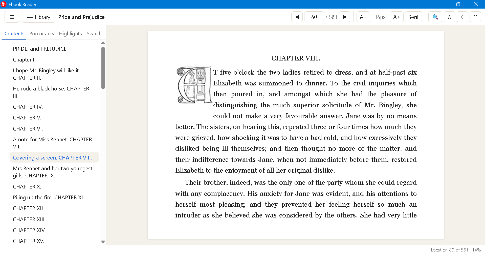
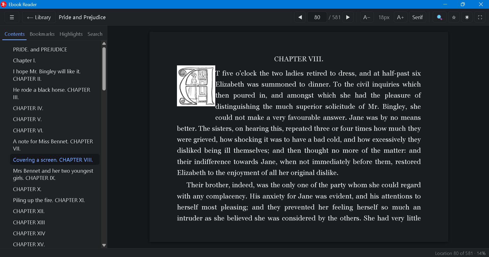

<p align="center">
  
</p>

# Ebook Reader

A simple, calm, **offline** reader for **PDF and EPUB** books on Windows.

No account, no internet connection, no tracking. Your books never leave your computer, and the app never changes your book files. Your bookmarks, highlights, notes and reading positions are kept in the app's own data folder.

<p align="center">
  
  
</p>

## Features

- **Open PDF and EPUB** with Ctrl+O, drag and drop, or right-click a book in File Explorer → *Open with* → Ebook Reader
- **Library:** a simple list of the books you have opened, with progress
- **Picks up where you left off:** page, zoom and text size are remembered for each book
- **One page at a time**, no animations: arrow keys, PgUp/PgDn, mouse wheel, go to page
- **Zoom** for PDFs (50–400 %, fit width, fit page) and **text size and font** for EPUBs
- **Day and night mode**, and **full screen**
- **Table of contents** you can click, and **word search** across the whole book
- **Bookmarks**, **highlights** in four colours, and **notes** attached to highlights

## Install

1. Go to the [Releases page](../../releases) and download `Ebook-Reader-Setup-<version>.exe` from the newest release.
2. Run it. Windows may say **"Windows protected your PC"** because the installer isn't signed by a publisher. Click **More info → Run anyway**.
3. Choose an install folder and finish. **Ebook Reader** appears in the Start menu.

Requires Windows 10 or 11 (64-bit). To update, run the newer installer; your library and notes are kept. Uninstalling also keeps them (in `%APPDATA%\Ebook Reader`); delete that folder to remove them too.

Ebook Reader only *offers* itself for `.pdf` and `.epub` files. It never takes over your default app; choose it yourself in *Open with* or Windows Settings if you want it as the default.

## Limitations

- Scanned PDFs (pages that are only pictures) can't be searched or highlighted.
- Copy-protected (DRM) books can't be opened.
- Links to websites inside books do nothing, because the app works offline only.
- Chinese, Japanese and Korean books have not been tested.
- The installer is unsigned (see the SmartScreen note above).

## For developers

Built with Electron, React, TypeScript, [pdf.js](https://mozilla.github.io/pdf.js/) and [foliate-js](https://github.com/johnfactotum/foliate-js). Run these in the `app/` folder:

```bash
npm install
npm run dev          # run the app in development
npm run typecheck
npm test             # unit tests
npm run test:e2e     # builds, then runs end-to-end tests (launch the real app)
npm run dist         # build the Windows installer into app/release/
```

The project is organised in numbered stages (spec → architecture → build → test → release). Start with [`CLAUDE.md`](CLAUDE.md) and [`HANDOFF.md`](HANDOFF.md). Release notes: [`stages/05_package-release/output/release-notes.md`](stages/05_package-release/output/release-notes.md).

## Status

Version 1.1.1 is released and tested (88 end-to-end and 53 unit tests, plus hand tests on a real Windows PC).

This is a personal project. There is no licence file yet, so all rights are reserved by the author.
